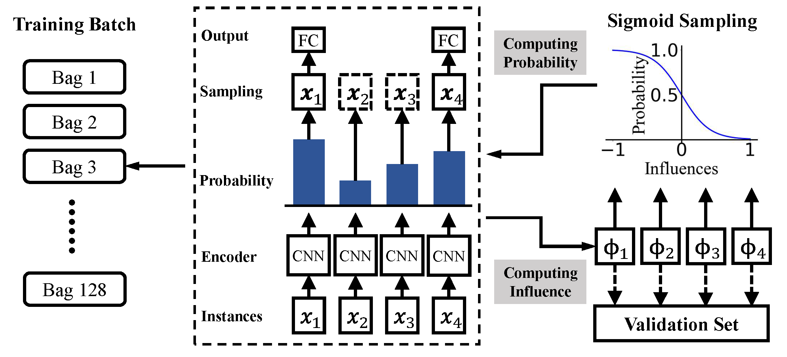
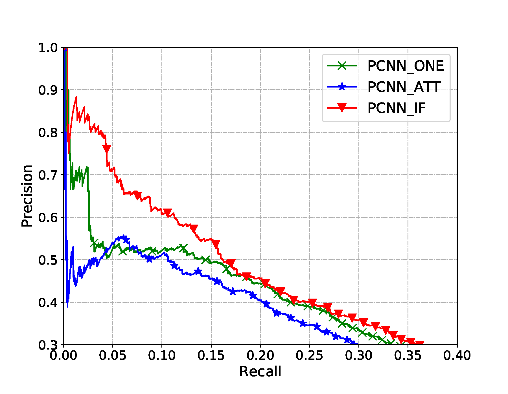
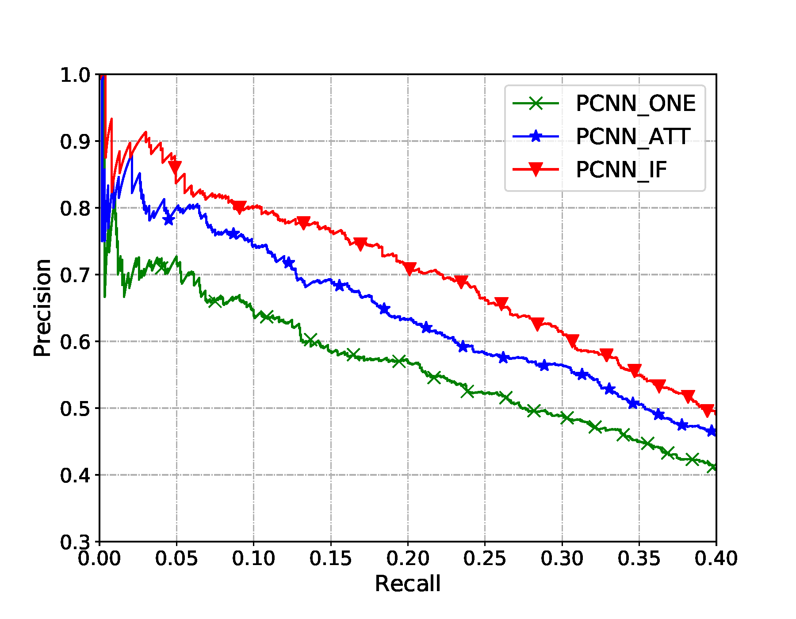

# Finding Influential Instances for Distant Supervision on Neural Relation Extraction

This repo is an adaptation of [pytorch-relation-extraction](https://github.com/ShomyLiu/pytorch-relation-extraction).


## Framework
<br/>
<p align="left"></p>
<br/>

## Data Preparation

### Download data from Baidu disk

**URL**: https://pan.baidu.com/s/1mWWAZ7PjnHmAvZHzgXczmQ 

**Code**：qq0o 

### Processing

```shell
# pre-processing
unzip NYT.zip -d dataset/
cd dataset/NYT/extract_cpp
g++ extract.cpp -o extract
./extract

# post-processing
# get back to the root path
python -u dataset/nyt.py
```


## Execute training

```shell
# Training PCNN+IF
python -u main_findif.py train --num_epochs=20 --sample_ratio=0.1 --data="NYT" --use_gpu=True

# Training PCNN+ATT
python -u main_att.py train --num_epochs=20 --data="NYT" --use_gpu=True

# Training PCNN+ONE
python -u main_mil.py train --num_epochs=20 --data="NYT" --use_gpu=True
```


## Visualize test results

```shell
# refer to the jupyter notebook
jupyter notebook plot_results.ipynb
```

### NYT-SMALL

<br/>
<p align="left"></p>
<br/>

### NYT-LARGE

<br/>
<p align="left"></p>
<br/>

## Visualize influences of instances

```shell
# calculate inverse HVP with the trained model
python -u tools/cal_inv_hvp.py go --use_gpu=True

# get influence of selected relation
# specify which relation you want to explore by set '--rel=?'
# the id-to-rel map can be seen in `dataset/NYT/extract_cpp/relation2id.txt`
python -u tools/visualize_demo.py go --rel=1 --use_gpu=False

# organize the demo files
python -u tools/organize_demo.py

# or execute the shell script directly
./run_vis_demo.sh
```

